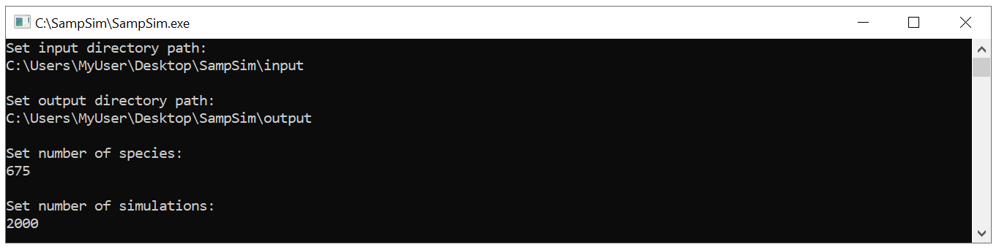
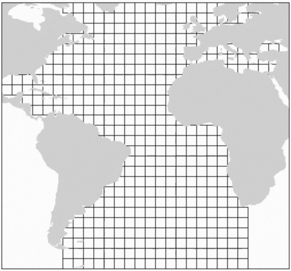
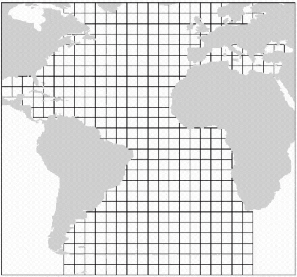
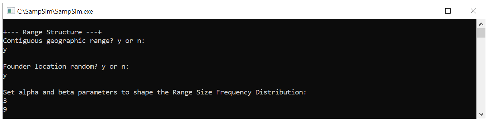
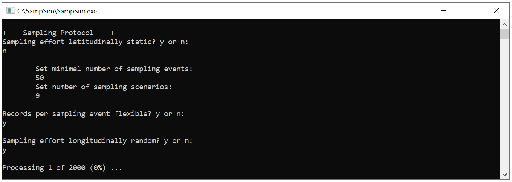

Marine Sampling Simulation
================

André Menegotto

 

## Introduction

The **SampSim** program replicates the real-world sampling effort in a
virtually controlled environment, which allows for identifying the
effects of sampling bias on marine macroecological patterns.
Specifically, it generates a spatial diversity pattern by simulating the
distribution of virtual species in a gridded domain, incorporates the
historical distribution of sampling effort for a specific taxonomic
group, and computes diversity metrics based on the virtually sampled
data. The simulation begins by establishing the geographical
distribution of all species and determining the true species diversity
within each grid cell and latitudinal band. Subsequently, the program
initiates the sampling process according to the historical latitudinal
distribution of sampling events. At each sampling event, random species
from a random grid cell are selected and recorded in a database. With
this database, designed to emulate real-world occurrence records
datasets, the program computes the observed and estimated species
richness, latitudinal gaps in species range, and inventory completeness
across all grid cells and latitudinal bands. The simulation’s code,
built in Delphi, is available in the *`./Simulation`* directory.

 

## The simulation

#### Initial information

The program requires two input files to execute the simulation: 1)
*‘NeigCellMat.txt’* contains a square matrix providing information about
the connections among the grid cells (0 = disconnected; 1 = connected);
2) *‘CellLatMat.txt’* contains a data frame with essential information
for each latitude, including the latitude (column 1), initial grid cell
in that latitude (column 2), number of grid cells in that latitude
(column 3) and the total number of sampling events (column 4). Once the
user specifies the input directory containing these files, s/he must
indicate the directory to save the simulation outputs, the number of
species to simulate, and the number of simulations to execute.

Simulation program screen display

 

The program produces 14 files describing: the true species richness
\[MatRichCell & MatRichLat\], the observed species richness after
sampling \[MatObsCell & MatObsLat\], the estimated species richness
according to three richness estimation techniques (nonparametric Chao 2
lower-bound asymptotic diversity estimator \[MatChao2Cell &
MatChao2Lat\]; sampled-based rarefaction fixed in 50 samples
\[MatES50Cell & MatES50Lat\]; and coverage-based
rarefaction/extrapolation \[MatInExtCell & MatInExtLat\]), and the
sample coverage \[MatCoverageCell & MatCoverageLat\] for all grid cells
and latitudinal bands, in addition to the number of species with
latitudinal gaps \[MatGapsLat\] and a setting report.

 

#### Range structure

The simulation utilizes two alternative range structures to create the
geographical distribution of the virtual species: the geometric
constraints model and the area model. In the geometric constraints
model, species ranges are contiguous, leading to a mid-domain effect.
Conversely, in the area model, species can occupy any unoccupied cell of
the geographic space, supposing an unlimited dispersal process and
leading to a spatially flat diversity distribution.

<b>     Geometric constraints
model</b>

<b>     Area model</b>

 

In addition to defining whether the range should be contiguous (denoted
by ‘y’ for yes) or not (denoted by ‘n’ for no), the user must also
indicate whether the founder location (i.e., the seed cell) should be
randomly placed (y; yes) or orientated toward a specific latitude (n;
no). If the latter option, s/he must provide the two (shape) parameters
of a beta distribution required to determine the probabilistic latitude
of the seed cell. Finally, the user must specify the two parameters of
the beta distribution guiding the range size frequency distribution of
the virtual species.

Simulation program screen display

 

#### Sampling protocol

Here, the user must first define whether the sampling effort will be
static (y; yes), meaning it will solely rely on the number of sampling
events provided in the *‘CellLatMat.txt’* file (column 4), or dynamic
(n; no). Opting for a dynamic sampling effort implies that the program
will simulate increasing sampling events at less sampled latitudes. In
this case, the user must specify the minimum number of sampling events,
ensuring that additional samples will be collected at all latitudes with
fewer samples than the specified value. This minimum value increases
progressively, creating ‘n’ different sampling scenarios as determined
by the user. Additionally, the user must define whether the number of
records per sampling event will be probabilistically determined (y; yes)
or fixed (n; no) for all latitudes. If affirmative, the
*‘CellLatMat.txt’* file should include the parameters of the beta
distribution (columns 5 and 6) that best describe the distribution of
records per sampling event at each latitude, in addition to the maximum
number of records per sampling event (column 7). If negative, the user
must specify the fixed number of records to be applied in all sampling
events. Finally, the user may choose for the sampling effort to be
randomly distributed across the latitude (y; yes) or longitudinally
constrained (n; no). If constrained, the *‘CellLatMat.txt’* file must
contain a parameter to shape the beta distribution controlling the
longitudinal disposition of the sampling events across the latitude
(column 8).

Simulation program screen display

 

## Analyzing brittle star sampling efforts in the Atlantic Ocean

We used the program to simulate the sampling effort of brittle stars
(class Ophiuroidea) having the Atlantic Ocean as our geographical
domain. Input files are available in the folder *`./Data/SimInput`*,
while output files are available in the folder *`./Data/SimOutput`*.
Empirical estimates derived from real-world ophiuroids distribution are
available in the folder *`./Data/Empirical`*. The R scripts required for
generating input files and analyzing results are accessible in the
folder *`./Scripts`*. In the output matrices, rows correspond to grid
cells or latitudes, and columns represent simulations. If the sampling
effort is not static and multiple sampling scenarios exist (Sampling
effort latitudinally static: n), the output file will contain three
columns for each scenario indicating the average and standard deviation
of the respective metric and the number of simulations. Output files
displaying -1 values indicate that it’s not possible to calculate the
estimates at that specific position during that particular simulation
due to a lack of sufficient data.

The code and data provided here were developed for the manuscript
[Sampling simulation in a virtual ocean reveals strong sampling effect
in marine diversity patterns](). Please refer to this manuscript for
more detailed information. If you have any questions or need
clarification, do not hesitate in contact me.

